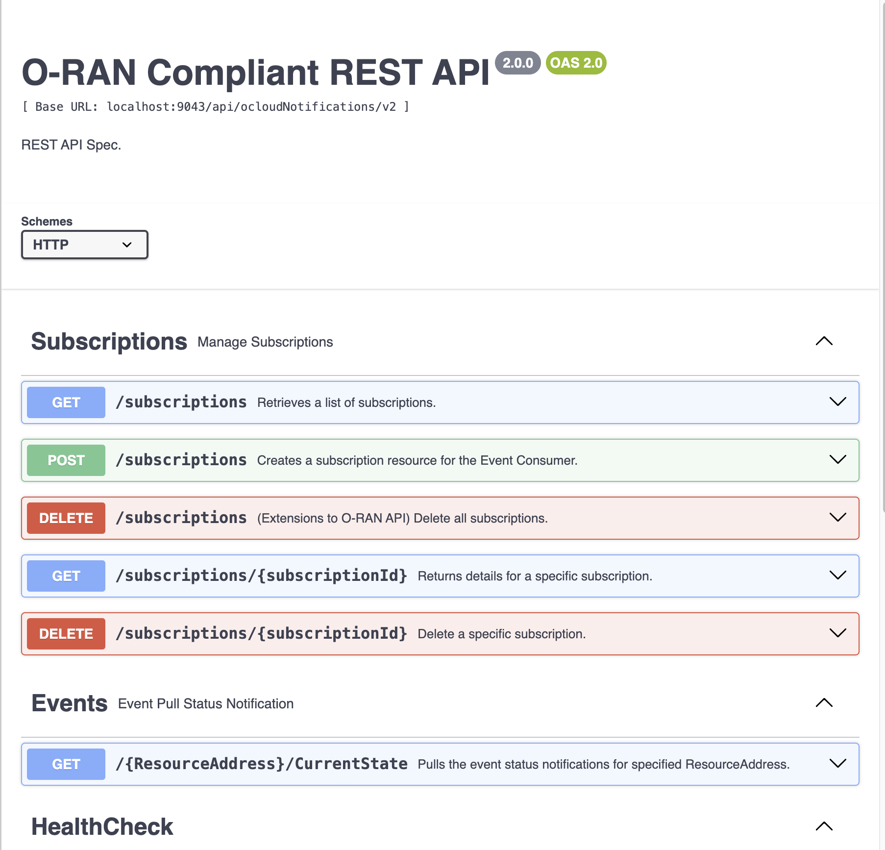

# Developers Guide

## Swagger UI

### View REST API Specification from Swagger Editor UI

Open https://editor.swagger.io/ in a browser. Click `File` - `Import file` from top menu and open the file [$WORKSPACE/redhat-cne/rest-api/v2/swagger.json](../v2/swagger.json). This loads the REST API specification like the following screenshot:



### Interact with REST-API in Swagger UI

You can interact with API endpoint by click `Try it out`, enter required parameters and click `Execute`.
This requires a REST-API server to be deployed at backend and accessible from localhost.

## Generate Swagger Spec

The swagger documentation of this repo is generated using tools and annotations based on https://github.com/go-swagger/go-swagger. The current version of go-swagger has an issue of generating empty definitions with go 1.20+. The workaround is to run swagger tool from docker.

Use the following commands to generate swagger spec file [v2/swagger.json](../v2/swagger.json).

```sh
go install github.com/go-swagger/go-swagger/cmd/swagger@latest
alias swagger='docker run --rm -it  --user $(id -u):$(id -g) -v $HOME:$HOME -w $PWD quay.io/goswagger/swagger'
swagger version

# generate spec without Go language specific extensions
cd $WORKSPACE/redhat-cne/rest-api/v2
SWAGGER_GENERATE_EXTENSION=false swagger generate spec --input tags.json -o swagger.json

# validate spec
swagger validate swagger.json
```

## Generate REST API Documentation

Use the following commands to generate swagger documentation markdown file [rest_api_v2.md](rest_api_v2.md).

```sh
# generate markdown doc
cd $WORKSPACE/redhat-cne/rest-api/v2
swagger generate markdown --skip-validation --output=../docs/rest_api_v2.md
```
